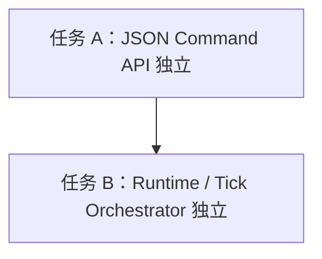
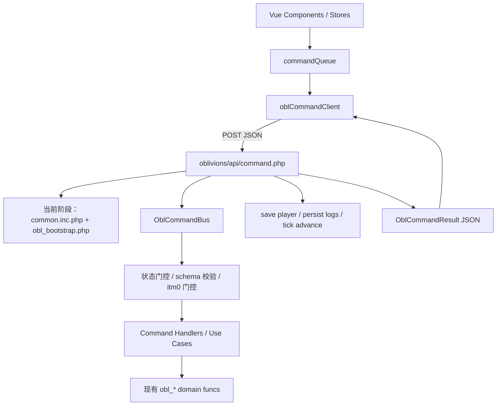

# Oblivions JSON Command API 独立设计案

> 目标：让 Oblivions 玩家写操作从旧 `command.php` / 表单 POST 通道中独立出来，建立专属 JSON Command API 与 Command Bus。  
> 边界：本文只设计 **Command 职能独立**；`common.inc.php` 解耦、Runtime、Tick Orchestrator 独立另见 [`OBL_RUNTIME_TICK_DESIGN.md`](./OBL_RUNTIME_TICK_DESIGN.md)。

---

## 0. 结论先行

当前 Oblivions 前端提交指令路径是：

```txt
vex-vue
  → commandQueue.execute(params)
  → submitCommand(params)
  → POST /phpdts/command.php
  → command.php 检测 Oblivions
  → oblivions/include/core/obl_command.php
  → oblivions_router.php
  → oblivions_commands.php / obl_* domain funcs
```

这个路径的问题不在于“不能用”，而在于它已经不适合作为 Oblivions 的长期写入口：

- 复杂命令 payload 被降级成 `x-www-form-urlencoded` 字符串。
- 战斗动作队列需要 `JSON.stringify()` 后塞进 `actions` 字段。
- 后端经过 `gstrfilter()` 后还要 `html_entity_decode()` 再 `json_decode()`。
- `command.php` 属于旧核心，Oblivions 继续挂在其下会扩大旧模式耦合。
- 命令名、参数、错误响应缺乏统一契约，不利于继续扩展战斗、合成、队列等复杂交互。

本设计案决定：

```txt
新路径：
  vex-vue
    → oblCommandClient.send(command, payload, options)
    → POST /phpdts/oblivions/api/command.php
    → Oblivions Command API
    → Oblivions Command Bus
    → 现有 obl_* domain funcs / 新 use case
```

新写入口使用：

```http
POST /phpdts/oblivions/api/command.php
Content-Type: application/json
```

请求体使用统一 Command Envelope：

```json
{
  "command": "battle.submit_turn",
  "request_id": "client-generated-id",
  "payload": {
    "actions": [
      { "act_id": "unarmed_strike", "target": 101, "params": {} }
    ]
  },
  "expected": {
    "action": "battle",
    "battle_state": "PLAYER_TURN",
    "bid": 42
  }
}
```

命令响应使用统一 JSON Result：

```json
{
  "status": "success",
  "code": "OK",
  "request_id": "client-generated-id",
  "data": {
    "tick_advanced": true,
    "refresh": ["player_info", "battle_log", "enemies"],
    "server_state": {
      "action": "battle",
      "battle_state": "PROCESSING",
      "bid": 42
    }
  }
}
```

---

## 1. 设计边界

### 1.1 本任务负责什么

本任务只解决 Oblivions 的 **玩家写命令通道**：

- 新建 Oblivions 专属 JSON Command API。
- 前端写操作不再调用旧 `command.php`。
- 后端接收原生 JSON payload。
- 建立 Command Envelope / Result / Error Code 契约。
- 建立语义化命令名。
- 建立后端 Command Bus。
- 迁移 vex-vue 的 `commandQueue` 到新 API。
- 废弃 Oblivions 在旧 `command.php` 下的核心写路径。

### 1.2 本任务不负责什么

本任务不处理以下内容：

- 不升级旧 `command.php`。
- 不让旧 `command.php` 支持 JSON。
- 不长期保留旧 Oblivions command 兼容路径。
- 不完成 `common.inc.php` 解耦。
- 不重建独立 Runtime / Request Context。
- 不重构完整 Tick Orchestrator。
- 不把读接口从 `api_v2.php` 全部迁走。
- 不引入 WebSocket / SSE。

### 1.3 与 Runtime 解耦任务的关系

Command API 独立是第一任务。

Runtime / Tick Orchestrator 独立是第二任务。

两者关系：



任务 A 完成后，Oblivions 写入口已经独立；但内部可以暂时继续依赖 `common.inc.php` 提供旧 runtime 能力。

任务 B 继续把这些旧 runtime 能力替换成 Oblivions 自己的 runtime。

---

## 2. 现状问题分析

### 2.1 当前命令提交方式

当前前端提交写命令走：

`D:\wamp64\www\phpdts\vex-vue\src\api\client.ts`

```ts
export async function submitCommand(params: Record<string, string>): Promise<CommandResult> {
  const body = new URLSearchParams({ mode: 'command', ...params });
  return fetch(`${API_BASE}/command.php`, {
    method: 'POST',
    headers: { 'Content-Type': 'application/x-www-form-urlencoded' },
    body,
    credentials: 'include',
  });
}
```

战斗动作队列提交：

`D:\wamp64\www\phpdts\vex-vue\src\components\battle\PreloadArea.vue`

```ts
commandQueue.execute({
  command: 'obl_battle_action',
  actions: JSON.stringify(actions),
});
```

后端解析：

`D:\wamp64\www\phpdts\oblivions\include\command\oblivions_router.php`

```php
function oblivions_parse_actions($post) {
    $actions = isset($post['actions']) ? $post['actions'] : null;
    if (is_string($actions)) {
        $decoded = json_decode(html_entity_decode($actions, ENT_QUOTES), true);
        return is_array($decoded) ? $decoded : null;
    }
    return $actions;
}
```

### 2.2 主要缺陷

#### 2.2.1 表单通道不适合复杂 payload

`actions` 是结构化动作队列，却被塞进表单字段。未来如果动作包含多目标、条件、瞄准参数、动作来源、预测状态等信息，表单字段会持续膨胀。

#### 2.2.2 过滤链污染 JSON

`gstrfilter()` 属于旧表单输入安全链，不适合处理原生 JSON。现在需要 `html_entity_decode()` 修复双引号，这是通道错配的典型症状。

#### 2.2.3 命令契约不清晰

当前命令靠约定：

```txt
command=obl_battle_action
附加字段 actions=...
```

但缺少统一 envelope、错误码、payload schema、状态期望、请求 ID。

#### 2.2.4 业务错误表达能力弱

Oblivions 命令成功通常返回 `{}`。这本身可以保留为“写入确认”，但复杂命令至少需要区分：

- 请求格式错误
- 命令不存在
- 状态冲突
- 队列非法
- AP 不足
- 目标无效
- 并发冲突
- 后端异常

这些不应该全靠日志和重新拉状态间接推断。

#### 2.2.5 旧 `command.php` 不应继续承载 Oblivions 演进

`command.php` 是旧核心命令入口。Oblivions 已经是独立模式，不应该继续把新通信层挂在旧入口下。

---

## 3. 新架构总览

### 3.1 新请求链路



### 3.2 文件规划

新增文件建议：

```txt
oblivions/
  api/
    command.php                         # JSON Command API 入口
  include/
    command/
      obl_command_bus.php               # 新 Command Bus
      obl_command_contract.php          # 命令元数据、命名、字段约束
      obl_command_handlers.php          # 新语义命令 handler
      obl_command_legacy_map.php        # 可选：新命令到旧 handler/domain funcs 的映射
    core/
      obl_command_response.php          # 响应与错误输出工具
      obl_json_request.php              # JSON body 解析工具
```

前端新增/调整：

```txt
vex-vue/src/api/obl-command.ts          # 新 JSON Command Client
vex-vue/src/stores/command-queue.ts     # 从 submitCommand 切到 oblCommandClient
vex-vue/src/stores/command-registry.ts  # 命令名改为新语义命名
vex-vue/src/components/battle/PreloadArea.vue
vex-vue/src/stores/tileAction.ts
vex-vue/src/stores/inventory.ts
vex-vue/src/stores/craft.ts
vex-vue/src/composables/useMapBusiness.ts
```

### 3.3 过渡策略

因为当前是纯开发阶段，没有旧用户和旧数据负担，策略应激进：

- 不做长期双轨。
- 新 API 建好后，vex-vue 直接切到新路径。
- 旧 `submitCommand()` 可保留给旧模式或删除 Oblivions 使用点。
- 旧 `oblivions_router.php` / `oblivions_commands.php` 可以被新 Command Bus 替代；若短期复用，也只是内部过渡，不作为新架构契约。

---

## 4. Command Envelope 契约

### 4.1 请求格式

```json
{
  "command": "battle.submit_turn",
  "request_id": "client-generated-id",
  "payload": {},
  "expected": {},
  "client": {
    "app": "vex-vue",
    "version": "dev",
    "sent_at": 1720000000000
  }
}
```

字段说明：

| 字段 | 类型 | 必填 | 说明 |
|---|---:|---:|---|
| `command` | string | 是 | 语义化命令名，如 `map.move` / `battle.submit_turn` |
| `request_id` | string | 建议 | 前端生成的请求 ID，用于日志串联与幂等预留 |
| `payload` | object | 是 | 命令参数对象，禁止再传 JSON 字符串 |
| `expected` | object | 否 | 前端期望的服务端状态，用于乐观状态校验 |
| `client` | object | 否 | 客户端调试信息 |

### 4.2 `request_id`

`request_id` 不是第一阶段强制幂等键，但必须透传：

- 前端生成。
- 后端日志记录。
- 响应原样返回。
- 后续可用于防重放 / 幂等表。

推荐格式：

```txt
obl-{timestamp}-{random}
```

或浏览器 `crypto.randomUUID()`。

### 4.3 `expected`

`expected` 用于状态冲突检查，不是必填，但战斗命令强烈建议传。

示例：

```json
{
  "action": "battle",
  "battle_state": "PLAYER_TURN",
  "bid": 42,
  "pid": 20,
  "tick": 128
}
```

第一阶段建议实现：

| expected 字段 | 检查方式 |
|---|---|
| `action` | 对比 `$pdata['action']` |
| `bid` | 对比 `$pdata['bid']` |
| `battle_state` | `obl_battle_state_get($pdata['bid'])` |
| `pid` | 对比 `$pdata['pid']` |

`tick` 可先仅记录，不作为硬拦截；否则前端频繁刷新时容易出现误拒。

### 4.4 payload 禁止事项

- 禁止把复杂对象再次 `JSON.stringify()` 后塞入字符串字段。
- 禁止使用旧字段名模拟表单结构，如 `{ actions: "[...]" }`。
- 禁止在 payload 中传任意 PHP 旧变量名。
- 后端只读取 command contract 声明过的字段。

---

## 5. 命令命名与 payload schema

### 5.1 命名原则

采用领域语义命名：

```txt
namespace.action
```

命名原则：

- `map.*`：地图移动、探索。
- `poi.*`：当前格 POI 交互。
- `item.*`：道具拾取、丢弃、使用。
- `inventory.*`：背包整理。
- `craft.*`：合成。
- `battle.*`：战斗开始、玩家回合提交。

### 5.2 命令映射表

| 当前命令 | 新命令 | payload | 是否推进 tick | 模式 | itm0 允许 |
|---|---|---|---:|---|---:|
| `move` | `map.move` | `{ "to": 5 }` | 是 | explore | 否 |
| `obl_explore` | `map.explore` | `{}` | 是 | explore | 否 |
| `obl_search` | `poi.search` | `{ "iaid": 123 }` | 是 | explore | 否 |
| `obl_pickup` | `item.pickup` | `{ "iid": 456 }` | 否 | explore | 否 |
| `obl_discard` | `item.discard` | `{ "slot": 3 }` | 否 | explore | 是 |
| `obl_use_item` | `item.use` | `{ "slot": 0 }` | 否 | explore | 是 |
| `obl_organize` | `inventory.organize` | `{}` | 否 | explore | 是 |
| `obl_craft` | `craft.execute` | `{ "slots": [{"slot":1,"count":1}], "workbench_materials": ["poi:123"] }` | 否 | explore | 否 |
| `obl_battle_start` | `battle.start` | `{ "actions": [...] }` | 是 | battle/pre-battle | 否 |
| `obl_battle_action` | `battle.submit_turn` | `{ "actions": [...] }` | 是 | battle | 否 |

说明：

- 前端 `command-registry.ts` 应使用新命令名。
- 后端 command contract 应成为 `mode` / `advances_tick` / `itm0_allowed` 的服务端真值源。
- 前端注册表仍可保留，用于 UI 预判，但后端必须兜底。

### 5.3 `map.move`

请求：

```json
{
  "command": "map.move",
  "payload": { "to": 5 }
}
```

约束：

- `to` 必须是整数。
- 后端调用 `obl_move($to, $pdata)`。
- 推进 tick。
- 成功建议刷新：`game_map`、`tile_actions`、`player_inventory`、`player_info`、`obl_log`、`battle_log`。

### 5.4 `map.explore`

请求：

```json
{
  "command": "map.explore",
  "payload": {}
}
```

约束：

- 无 payload。
- 后端调用 `obl_explore($pdata)`。
- 推进 tick。

### 5.5 `poi.search`

请求：

```json
{
  "command": "poi.search",
  "payload": { "iaid": 123 }
}
```

约束：

- `iaid` 必须是整数。
- 后端调用 `obl_search_poi($iaid, $pdata)`。
- 推进 tick。

### 5.6 `item.pickup`

请求：

```json
{
  "command": "item.pickup",
  "payload": { "iid": 456 }
}
```

约束：

- `iid` 必须是整数。
- 后端调用 `obl_pickup_item($iid, $pdata)`。
- 不推进 tick。

### 5.7 `item.discard`

请求：

```json
{
  "command": "item.discard",
  "payload": { "slot": 3 }
}
```

约束：

- `slot` 必须是整数。
- `slot=0` 表示丢弃 `itm0`。
- 后端调用 `obl_discard_item($slot, $pdata)`。
- 不推进 tick。
- `itm0` pending 时允许。

### 5.8 `item.use`

请求：

```json
{
  "command": "item.use",
  "payload": { "slot": 0 }
}
```

约束：

- `slot` 必须是整数。
- `itm0` pending 时只允许 `slot=0`。
- 后端调用 `item_use($slot, $pdata)`。
- 不推进 tick。

### 5.9 `inventory.organize`

请求：

```json
{
  "command": "inventory.organize",
  "payload": {}
}
```

约束：

- 无 payload。
- 后端调用 `obl_organize_inventory($pdata)`。
- 不推进 tick。
- `itm0` pending 时允许。

### 5.10 `craft.execute`

当前前端传：

```txt
slots="1:1,2:2"
workbench_materials="poi:123,passive:innate_t0"
```

新 payload：

```json
{
  "command": "craft.execute",
  "payload": {
    "slots": [
      { "slot": 1, "count": 1 },
      { "slot": 2, "count": 2 }
    ],
    "workbench_materials": ["poi:123", "passive:innate_t0"]
  }
}
```

第一阶段后端可在 Command Handler 内转回旧函数需要的字符串：

```txt
slotsStr = "1:1,2:2"
wbStr = "poi:123,passive:innate_t0"
```

然后调用：

```php
item_craft($slotsStr, $pdata, $wbStr);
```

后续 Runtime / domain 重构时再让 `item_craft()` 原生支持数组。

### 5.11 `battle.start`

主动攻击 / 突袭命令。

请求：

```json
{
  "command": "battle.start",
  "payload": {
    "actions": [
      {
        "act_id": "unarmed_strike",
        "target": 101,
        "params": {}
      }
    ]
  },
  "expected": {
    "action": "",
    "pid": 20
  }
}
```

约束：

- `actions` 必须是非空数组。
- 每个 action 必须有 `act_id`。
- `target` 视技能目标类型决定是否必填；第一阶段所有 enemy 技能必须有 target。
- 后端调用 `battle_entry_dispatch('ambush', $pdata, $actions)`。
- 推进 tick。

兼容现有 battle entry：

当前 `battle_entry_dispatch()` 读取 action 字段名是 `act_id` + `target`，新 payload 保持一致。

注意：旧队列项里有前端本地 `id`：

```ts
{ id: 1, act_id: 'xxx', target: 101 }
```

新 API 不要求传 `id`；如传入，后端忽略。建议前端发送前剥离 UI-only 字段。

### 5.12 `battle.submit_turn`

战斗中玩家回合提交。

请求：

```json
{
  "command": "battle.submit_turn",
  "payload": {
    "actions": [
      {
        "act_id": "unarmed_strike",
        "target": 101,
        "params": {}
      }
    ]
  },
  "expected": {
    "action": "battle",
    "battle_state": "PLAYER_TURN",
    "bid": 42,
    "pid": 20
  }
}
```

约束：

- 玩家必须处于 `action='battle'`。
- 当前战场状态必须是 `PLAYER_TURN`。
- `bid` 必须匹配当前玩家 `$pdata['bid']`。
- 后端调用 `battle_entry_dispatch('player_turn', $pdata, $actions)`。
- 命令执行后触发 `PLAYER_TURN → PROCESSING`。
- 推进 tick。

---

## 6. 响应格式

### 6.1 成功响应

```json
{
  "status": "success",
  "code": "OK",
  "request_id": "client-generated-id",
  "message": "",
  "data": {
    "command": "battle.submit_turn",
    "tick_advanced": true,
    "refresh": ["player_info", "battle_log"],
    "server_state": {
      "pid": 20,
      "action": "battle",
      "bid": 42,
      "battle_state": "PROCESSING",
      "tick": 129
    }
  }
}
```

字段说明：

| 字段 | 说明 |
|---|---|
| `status` | `success` / `error` |
| `code` | 机器可读 code |
| `request_id` | 请求 ID 原样返回 |
| `message` | 人类可读提示，可为空 |
| `data.command` | 实际执行的命令 |
| `data.tick_advanced` | 是否推进 tick |
| `data.refresh` | 建议前端刷新哪些数据 |
| `data.server_state` | 轻量服务端状态快照 |

### 6.2 错误响应

```json
{
  "status": "error",
  "code": "STATE_CONFLICT",
  "request_id": "client-generated-id",
  "message": "当前已不是玩家回合",
  "details": {
    "expected": { "battle_state": "PLAYER_TURN" },
    "actual": { "battle_state": "PROCESSING" }
  },
  "data": {
    "refresh": ["player_info", "battle_log"],
    "server_state": {
      "action": "battle",
      "battle_state": "PROCESSING",
      "bid": 42
    }
  }
}
```

### 6.3 错误码

| code | HTTP | 场景 | 前端建议 |
|---|---:|---|---|
| `OK` | 200 | 成功 | 按 `refresh` 刷新 |
| `BAD_JSON` | 400 | JSON 解析失败 | toast + debug |
| `INVALID_ENVELOPE` | 400 | envelope 缺字段或类型错误 | toast + debug |
| `UNKNOWN_COMMAND` | 400 | command 不存在 | debug |
| `INVALID_PAYLOAD` | 400 | payload schema 错误 | toast + debug |
| `AUTH_FAILED` | 401 | 未登录 / 玩家无效 | 跳登录或刷新 |
| `COMMAND_IN_PROGRESS` | 409 | 同玩家命令锁冲突 | 稍候重试 |
| `COMMAND_NOT_ALLOWED` | 409 | 当前 action 不允许该命令 | 刷新 player_info |
| `ITM0_PENDING` | 409 | `itm0` 阻塞 | 刷新背包，提示处理手持道具 |
| `BATTLE_BUSY` | 409 | 有战场 PROCESSING，拒绝推进 tick 命令 | 刷新 player_info / battle_log |
| `STATE_CONFLICT` | 409 | expected 与实际状态不符 | 刷新状态 |
| `DOMAIN_REJECTED` | 422 | 领域逻辑拒绝，如目标无效、AP 不足 | toast + 刷新相关数据 |
| `PHP_FATAL` | 500 | fatal 兜底 | 错误 toast |
| `INTERNAL_ERROR` | 500 | 未分类异常 | 错误 toast |

### 6.4 HTTP 状态码原则

第一阶段可全部返回 HTTP 200 并依赖 `status/code`，但建议直接使用合理 HTTP 状态：

- 200：业务成功。
- 400：请求格式错误。
- 401：认证失败。
- 409：状态/并发冲突。
- 422：命令格式正确但领域拒绝。
- 500：服务端异常。

前端判断以 JSON `status` 为准，HTTP code 用于辅助诊断。

---

## 7. 后端执行流程

### 7.1 `oblivions/api/command.php` 职责

入口文件只做 HTTP 层：

1. 定义 `CURSCRIPT`。
2. 当前阶段暂时 require `common.inc.php`。
3. require `obl_bootstrap.php`。
4. 设置 JSON header。
5. 解析 JSON body。
6. 调用 `obl_command_bus_dispatch($envelope, $context)`。
7. 输出统一响应。

禁止在入口文件中写具体游戏规则。

### 7.2 第一阶段仍可复用旧 command 生命周期

为了避免 Command API 与 Runtime 解耦混在一起，第一阶段可以复用现有 `obl_command.php` 中的生命周期逻辑，但应抽成函数，而不是复制粘贴。

建议新增：

```php
function obl_command_api_handle($envelope) {
    // auth
    // lock
    // validate
    // dispatch
    // transition
    // persist logs
    // save player
    // tick advance
    // response
}
```

或者：

```php
function obl_command_runtime_handle_envelope($envelope) { ... }
```

注意：这里的 “runtime” 只是当前任务内部复用流程名，不等同于第二任务里的完整独立 OblRuntime。

### 7.3 后端流程细节

```txt
[A] 解析 JSON envelope
[B] obl_game_entrypoint('command') 获取 $pdata
[C] 获取同玩家 flock 锁
[D] 读取 command contract
[E] envelope / payload schema 校验
[F] expected 状态校验
[G] command_allowed_by_state 校验
[H] itm0 门控
[I] battle busy / advances_tick 校验
[J] Command Bus dispatch
[K] 战斗状态机 PLAYER_TURN → PROCESSING
[L] 持久化 obl_log / obl_error_log / obl_battle_log
[M] obl_save_player($pdata)
[N] 如 advances_tick：obl_tick_advance() + save_gameinfo()
[O] 构造 Command Result
```

这基本复用当前 `obl_command.php` 事实流程，只是输入从 `$_POST` 变成 JSON envelope，输出从 `{}` 变成结构化 result。

### 7.4 并发锁

继续使用现有 flock 策略：

```txt
oblivions/cache/locks/obl_lock_{groomid}_{pid}.php
```

抢锁失败返回：

```json
{
  "status": "error",
  "code": "COMMAND_IN_PROGRESS"
}
```

### 7.5 状态门控

后端 command contract 中应有：

```php
'allowed_actions' => [''],
'mode' => 'explore',
'advances_tick' => true,
'itm0_allowed' => false,
```

但第一阶段可继续调用：

```php
obl_command_allowed_by_state($legacyCommand, $pdata['action'])
```

或者直接实现新命令版：

```php
obl_command_allowed_by_state_v2($command, $pdata['action'])
```

建议实现新命令版，避免继续依赖旧命令名。

规则：

- `action === 'battle'` 时，只允许 `battle.submit_turn`。
- `action !== 'battle'` 时，不允许 `battle.submit_turn`。
- `battle.start` 只允许非 battle 状态。
- 探索类命令只允许非 battle 状态。

### 7.6 itm0 门控

当前后端门控：

```php
$itm0_pending = isset($pdata['itempara'][0]) && ...;
if ($itm0_pending && !in_array($command, ['obl_organize', 'obl_discard', 'obl_use_item'], true)) { ... }
```

新规则：

```php
$itm0Allowed = $contract['itm0_allowed'];
if ($itm0_pending && !$itm0Allowed) {
    return error('ITM0_PENDING');
}
```

`item.use` 仍需要二次校验：

```php
if ($itm0_pending && $payload['slot'] !== 0) {
    return error('ITM0_PENDING');
}
```

### 7.7 advances_tick

服务端 contract 是真值源：

```php
'advances_tick' => true/false
```

推进 tick 的命令：

- `map.move`
- `map.explore`
- `poi.search`
- `battle.start`
- `battle.submit_turn`

不推进 tick：

- `item.pickup`
- `item.discard`
- `item.use`
- `inventory.organize`
- `craft.execute`

第一阶段仍可复用 `obl_tick_advance()`。

### 7.8 Command Bus Dispatch

建议结构：

```php
function obl_command_bus_dispatch($envelope, &$pdata) {
    $command = $envelope['command'];
    $payload = $envelope['payload'];

    switch ($command) {
        case 'map.move':
            return obl_cmd_map_move($payload, $pdata);
        case 'battle.submit_turn':
            return obl_cmd_battle_submit_turn($payload, $pdata);
        ...
    }
}
```

handler 返回内部结果：

```php
array(
  'ok' => true,
  'refresh' => array('player_info', 'battle_log'),
  'domain_code' => 'OK',
)
```

领域函数目前大多无 return，所以第一阶段 handler 可以把“未抛异常 / 未 fatal”视为 accepted。业务失败仍可能通过日志表达。后续再逐步给关键领域函数增加结构化返回。

---

## 8. 前端改造方案

### 8.1 新增 `obl-command.ts`

文件：

`D:\wamp64\www\phpdts\vex-vue\src\api\obl-command.ts`

职责：

- 生成 request id。
- 发送 JSON command envelope。
- 统一解析 result。
- 网络错误转换为 `CommandResult`。
- 提供 TypeScript 类型。

建议接口：

```ts
export interface OblCommandEnvelope<TPayload = unknown> {
  command: string;
  request_id?: string;
  payload: TPayload;
  expected?: Record<string, unknown>;
  client?: {
    app?: string;
    version?: string;
    sent_at?: number;
  };
}

export interface OblCommandResponse<TData = unknown> {
  status: 'success' | 'error';
  code: string;
  request_id?: string;
  message?: string;
  data?: TData;
  details?: unknown;
}

export async function sendOblCommand<TPayload, TData = unknown>(
  command: string,
  payload: TPayload,
  options?: {
    expected?: Record<string, unknown>;
    requestId?: string;
  },
): Promise<OblCommandResponse<TData>>;
```

### 8.2 `commandQueue.execute` 接口调整

当前：

```ts
execute(params: Record<string, string>): Promise<CommandResult>
```

建议改成：

```ts
execute<TPayload>(
  command: string,
  payload?: TPayload,
  options?: { expected?: Record<string, unknown> },
): Promise<CommandResult>
```

示例：

```ts
await commandQueue.execute('map.move', { to: Number(areaId) });
```

```ts
await commandQueue.execute('battle.submit_turn', { actions }, {
  expected: {
    action: 'battle',
    battle_state: 'PLAYER_TURN',
    bid: playerStore.bid,
  },
});
```

为了降低一次性修改复杂度，也可以先保留对象入参，但对象结构改成：

```ts
commandQueue.execute({
  command: 'battle.submit_turn',
  payload: { actions },
  expected: { battle_state: 'PLAYER_TURN' },
});
```

更推荐第二种，改动面较小。

### 8.3 `COMMAND_REGISTRY` 改用新命令名

从：

```ts
obl_battle_action: { mode: 'battle', advancesTick: true, itm0Allowed: false }
```

改为：

```ts
'battle.submit_turn': { mode: 'battle', advancesTick: true, itm0Allowed: false }
```

完整表与后端 contract 对齐。

### 8.4 前端调用点迁移

#### 移动

旧：

```ts
commandQueue.execute({ command: 'move', moveto: String(areaId) })
```

新：

```ts
commandQueue.execute({
  command: 'map.move',
  payload: { to: Number(areaId) },
})
```

#### 探索

旧：

```ts
commandQueue.execute({ command: 'obl_explore' })
```

新：

```ts
commandQueue.execute({
  command: 'map.explore',
  payload: {},
})
```

#### 搜索

旧：

```ts
commandQueue.execute({ command: 'obl_search', iaid: String(iaid) })
```

新：

```ts
commandQueue.execute({
  command: 'poi.search',
  payload: { iaid: Number(iaid) },
})
```

#### 拾取

```ts
commandQueue.execute({
  command: 'item.pickup',
  payload: { iid: Number(iid) },
})
```

#### 背包

```ts
commandQueue.execute({
  command: 'item.discard',
  payload: { slot: Number(slot) },
})

commandQueue.execute({
  command: 'item.use',
  payload: { slot: Number(slot) },
})

commandQueue.execute({
  command: 'inventory.organize',
  payload: {},
})
```

#### 合成

旧：

```ts
commandQueue.execute({
  command: 'obl_craft',
  slots: slotsStr,
  workbench_materials: wbStr,
})
```

新：

```ts
commandQueue.execute({
  command: 'craft.execute',
  payload: {
    slots: backpackSlots.value.map(s => ({ slot: s.slot, count: s.count })),
    workbench_materials: wbMaterialIds.value,
  },
})
```

#### 战斗开始

旧：

```ts
commandQueue.execute({
  command: 'obl_battle_start',
  actions: JSON.stringify(actions),
})
```

新：

```ts
commandQueue.execute({
  command: 'battle.start',
  payload: {
    actions: normalizeActions(actions),
  },
  expected: {
    action: '',
    pid: playerPid.value,
  },
})
```

#### 战斗回合提交

```ts
commandQueue.execute({
  command: 'battle.submit_turn',
  payload: {
    actions: normalizeActions(actions),
  },
  expected: {
    action: 'battle',
    battle_state: 'PLAYER_TURN',
    pid: playerPid.value,
  },
})
```

### 8.5 `normalizeActions`

前端应剥离 UI-only 字段：

```ts
function normalizeActions(actions: QueueItem[]): BattleActionPayload[] {
  return actions.map(a => ({
    act_id: a.act_id,
    target: Number(a.target),
    params: {},
  }));
}
```

后端可以容忍 `id` 字段，但前端不应继续发送。

### 8.6 返回后刷新策略

当前前端成功后手动 invalidate / broadcast。新响应提供 `data.refresh` 后，可以逐步改成：

```ts
if (result.status === 'success') {
  for (const action of result.data?.refresh ?? []) {
    dataManager.invalidate(action);
  }
}
```

第一阶段不强制完全自动化；可保留原调用点的刷新逻辑，避免一次性牵动过大。

---

## 9. 后端 Command Contract 设计

### 9.1 Contract 示例

```php
function obl_command_contracts() {
    return array(
        'map.move' => array(
            'mode' => 'explore',
            'advances_tick' => true,
            'itm0_allowed' => false,
            'payload_schema' => array(
                'to' => array('type' => 'int', 'required' => true),
            ),
            'refresh' => array('player_info', 'game_map', 'tile_actions', 'player_inventory', 'obl_log', 'battle_log'),
        ),
        'battle.submit_turn' => array(
            'mode' => 'battle',
            'advances_tick' => true,
            'itm0_allowed' => false,
            'payload_schema' => array(
                'actions' => array('type' => 'actions', 'required' => true),
            ),
            'expected' => array('action', 'battle_state', 'bid'),
            'refresh' => array('player_info', 'battle_log', 'enemies'),
        ),
    );
}
```

### 9.2 Payload schema 第一阶段能力

无需引入大型验证库，先实现轻量函数：

```php
obl_command_validate_payload($command, $payload, $schema)
```

支持类型：

| 类型 | 校验 |
|---|---|
| `int` | `is_numeric` 且转 int |
| `string` | `is_string` |
| `array` | `is_array` |
| `actions` | array 且每项含 `act_id`，必要时含 `target` |
| `slot_counts` | array，每项含 int `slot` / int `count` |
| `string_list` | array of string |

校验函数应返回：

```php
array('ok' => true, 'payload' => $normalizedPayload)
```

或：

```php
array('ok' => false, 'code' => 'INVALID_PAYLOAD', 'details' => ...)
```

### 9.3 Action payload 校验

第一阶段最小校验：

```php
function obl_validate_actions($actions) {
    if (!is_array($actions) || empty($actions)) return error;
    foreach ($actions as $idx => $action) {
        if (!is_array($action)) return error;
        if (empty($action['act_id']) || !is_string($action['act_id'])) return error;
        if (isset($action['target'])) $action['target'] = (int)$action['target'];
        if (!isset($action['params']) || !is_array($action['params'])) $action['params'] = array();
    }
    return normalized;
}
```

技能可用性、AP、CD、目标合法性应由 battle domain 进一步判断。后续可提升到 command validator。

---

## 10. 安全与输入处理

### 10.1 JSON body 解析

新 API 不走 `gstrfilter()` 处理 JSON body。

入口应使用：

```php
$raw = file_get_contents('php://input');
$body = json_decode($raw, true);
```

错误：

```php
json_last_error() !== JSON_ERROR_NONE → BAD_JSON
```

### 10.2 字符串过滤

不应对整个 JSON 做 HTML 转义。应该按字段语义校验和规范化：

- 命令名：白名单匹配。
- `act_id`：只允许 `[a-zA-Z0-9_.:-]` 风格 ID。
- `workbench_materials`：只允许预期 ID 格式。
- 数值：强转 int。
- 不信任前端传入的 pid / bid，只用于 expected 校验。

### 10.3 CSRF / Cookie

当前前端使用 cookie 登录态和 same-origin 请求。

第一阶段保持：

```ts
credentials: 'include'
```

后端保持同源策略。若未来需要 CSRF token，可在 Runtime 解耦任务中统一设计。

### 10.4 不信任 client expected

`expected` 只用于冲突检测，不用于授权。

例如：

- 前端传 `pid=20`，后端仍以认证得到的 `$pdata['pid']` 为准。
- 前端传 `bid=42`，后端只检查是否等于 `$pdata['bid']`。

---

## 11. 日志与调试

### 11.1 request_id 串联

后端应在错误日志或 debug 日志中记录：

- `request_id`
- `command`
- `pid`
- `groomid`
- `payload` 摘要
- `code`

不要把完整 payload 盲目写入普通日志，避免日志膨胀。

### 11.2 前端 DebugBus

前端 `debugBus.emit('action', ...)` 中应记录新命令名：

```ts
debugBus.emit('action', 'command:send', { command, request_id });
debugBus.emit('action', 'command:result', { command, code, status });
```

### 11.3 错误日志

命令被后端拒绝时，建议同时：

- 返回结构化错误给前端。
- 写入 `obl_error_log`，方便复盘。

例如：

```php
$obl_error_log->emit('command.rejected', array(
  'request_id' => $requestId,
  'command' => $command,
  'code' => 'STATE_CONFLICT',
), 'command');
```

---

## 12. 与 battle_log played 机制的关系

本设计不改变战斗日志播放机制。

仍然保持：

```txt
命令执行
  → 后端 emit battle_log
  → 持久化 played=0
  → 前端拉 battle_log
  → battle-director 编排播放
  → mark_battle_log_played.php 标记 played=1
```

改变的是命令提交方式，不改变 battle_log 消费路径。

但新 command 响应可以通过 `refresh` 提示前端：

```json
"refresh": ["player_info", "battle_log"]
```

前端收到成功后仍调用现有 `refreshBattle()`。

---

## 13. 与 Tick 的关系

本设计不重构 Tick Orchestrator，但需要保持当前行为一致。

第一阶段：

- `advances_tick=true` 的新命令执行后，仍调用现有 `obl_tick_advance()`。
- 战斗命令执行后，仍执行 `PLAYER_TURN → PROCESSING` 状态机过渡。
- `PROCESSING` busy 检查仍保留。
- NPC 回合推进机制暂不改变。

也就是说：

> Command API 独立只替换“怎么提交命令”和“怎么分发命令”，不改变“命令后如何推进世界”的底层机制。

Tick 集中调度将在 `OBL_RUNTIME_TICK_DESIGN.md` 中单独展开。

---

## 14. 实施步骤

### Step 1：新增后端 JSON API 基础文件

新增：

```txt
oblivions/api/command.php
oblivions/include/core/obl_json_request.php
oblivions/include/core/obl_command_response.php
```

完成：

- JSON body 解析。
- 统一 success/error 输出。
- fatal shutdown JSON 兜底。
- 暂时返回 `UNKNOWN_COMMAND`，验证入口可用。

### Step 2：新增 Command Contract / Command Bus

新增：

```txt
oblivions/include/command/obl_command_contract.php
oblivions/include/command/obl_command_bus.php
oblivions/include/command/obl_command_handlers.php
```

完成：

- 新命令注册表。
- payload schema 校验。
- 状态门控。
- itm0 门控。
- advances_tick 判断。
- handler 分发。

### Step 3：接入现有领域函数

实现所有命令 handler：

- `map.move`
- `map.explore`
- `poi.search`
- `item.pickup`
- `item.discard`
- `item.use`
- `inventory.organize`
- `craft.execute`
- `battle.start`
- `battle.submit_turn`

第一阶段可直接调用现有函数。

### Step 4：复刻当前 `obl_command.php` 后处理流程

把当前流程移到可复用函数：

- flock lock。
- 日志持久化。
- battle 状态机过渡。
- `obl_save_player()`。
- `obl_tick_advance()`。
- `save_gameinfo()`。

避免把这套逻辑复制在入口文件里。

### Step 5：新增前端 `obl-command.ts`

完成：

- `sendOblCommand()`。
- request id。
- JSON POST。
- result 转换。
- 网络错误处理。

### Step 6：改造 `commandQueue`

完成：

- 入参从表单 params 改为 envelope。
- `_checkLocks(command)` 使用新命令名。
- 成功后根据 `advancesTick` 继续 `_checkBattleState()`。
- 保持 `canExecute(command)` 语义。

### Step 7：迁移前端调用点

逐个迁移：

- `useMapBusiness.ts`
- `tileAction.ts`
- `inventory.ts`
- `craft.ts`
- `PreloadArea.vue`
- 所有 `canExecute('旧命令')`

### Step 8：废弃 Oblivions 旧写路径

vex-vue 全部切新 API 后：

- 搜索确认没有 `submitCommand()` 的 Oblivions 使用点。
- `command.php` 不再是 Oblivions 写路径。
- 可以让旧 Oblivions command 分支返回 deprecated 错误，或暂时不管但文档标记废弃。

### Step 9：文档更新

更新：

- `oblivions/CODEBASE.md`
- `vex-vue/CODEBASE.md`
- 必要时更新 `oblivions/DESIGN.md`

说明新写入口、新命令名、新响应格式。

---

## 15. 验收标准

### 15.1 功能验收

- 前端所有玩家写操作不再请求 `/phpdts/command.php`。
- 前端写操作统一请求 `/phpdts/oblivions/api/command.php`。
- 战斗动作队列以 JSON 数组提交，不再 `JSON.stringify()` 成表单字段。
- `battle.start` 可正常触发主动战斗。
- `battle.submit_turn` 可正常提交玩家回合。
- 移动、探索、搜索、拾取、丢弃、使用、整理、合成均正常。
- 命令后刷新、日志、战斗演出与当前行为一致。

### 15.2 架构验收

- `command.php` 不再承载 Oblivions 写入口。
- 后端有统一 Command Contract。
- 后端有统一 Command Bus。
- 后端错误响应有稳定 `status/code/message/details/data` 结构。
- 前端 `COMMAND_REGISTRY` 使用新命令名。
- 前端 `commandQueue` 不再依赖旧 `submitCommand()`。

### 15.3 回归重点

重点测试：

1. 快速连点移动：前端锁 + 后端 flock 是否仍生效。
2. `itm0` pending：非允许命令是否返回 `ITM0_PENDING`。
3. 战斗 `PROCESSING`：推进 tick 命令是否被拒绝。
4. 战斗玩家回合：`PLAYER_TURN → PROCESSING` 是否正常。
5. battle_log：命令后是否仍持久化并可播放。
6. 合成：新数组 payload 是否正确转为现有 craft 参数。
7. 错误 JSON：坏请求是否返回 `BAD_JSON` / `INVALID_PAYLOAD`。

---

## 16. 风险与对策

### 16.1 风险：领域函数无结构化返回

现有 `obl_*` 函数大多通过修改 `$pdata`、写日志、写 DB 表达结果，缺少 return。

对策：

- 第一阶段命令 API 只承诺“命令已被接受并执行流程完成”。
- 业务结果仍通过状态刷新和日志体现。
- 对关键命令逐步补充 domain result。

### 16.2 风险：前端一次性改调用点遗漏

对策：

- 全局搜索旧命令名：`obl_`、`command: 'move'`、`submitCommand`。
- `commandQueue` 中拒绝未知命令。
- 浏览器 Network 确认无 `/command.php` 请求。

### 16.3 风险：状态门控与前端 registry 不一致

对策：

- 后端 contract 为真值源。
- 前端 registry 与后端 contract 文档同步。
- 未来 Runtime 任务可考虑提供 `/oblivions/api/command_contract.php` 供前端生成或校验。

### 16.4 风险：JSON 输入绕过旧过滤

对策：

- 不做全局 HTML 过滤，改用白名单 schema 校验。
- 所有命令名、ID、slot、target 均规范化。
- SQL 仍通过现有函数处理，不拼接未校验字符串。

### 16.5 风险：与 Runtime 解耦边界混淆

对策：

- 本任务允许暂时 require `common.inc.php`。
- 不在本任务中重写认证、DB、gamevars。
- Tick 行为保持现状。
- Runtime 解耦另案设计。

---

## 17. 后续演进

Command API 独立完成后，后续可以继续推进：

1. Runtime / Tick Orchestrator 独立。
2. `api_v2.php` 读接口迁移到 `oblivions/api/state.php`。
3. `mark_battle_log_played.php` 归入 Oblivions API 体系。
4. Command Result 增加更丰富 domain result。
5. 引入 request_id 幂等表，防止重复提交。
6. 如有需要，再考虑 SSE / WebSocket 推送 battle_log 或 state changed。

---

## 18. 最小可执行切入点

如果要开始实施，建议第一刀不是全量迁移，而是先打通 `battle.submit_turn`：

1. 新建 `/oblivions/api/command.php`。
2. 支持 `battle.submit_turn` JSON envelope。
3. 后端调用现有 `battle_entry_dispatch('player_turn', $pdata, $actions)`。
4. 前端 `PreloadArea.vue` 改用新 API 提交战斗动作队列。
5. 验证 battle_log 播放和状态机正常。

一旦最复杂的战斗动作队列打通，其余命令迁移风险明显更低。

但由于当前是纯开发阶段，也可以直接按 Step 1~9 一次性完成全量切换。

---

## 19. 设计复核修订记录（2026-07-08）

> 本节是在按现有代码复核后追加的修订。若与前文示例存在细节差异，以本节为准。

### 19.1 `battle.start` 的 mode / action 语义修正

前文把 `battle.start` 的“模式”写成 `battle/pre-battle`，容易误解为后端玩家 `action='battle'` 时也可提交 `battle.start`。

实际现状是：

- 前端 `battleStore.startBattle()` 会先把 UI `currentMode` 切到 `battle`，并打开 `PreloadArea` 的 `pre-battle` 装填模式。
- 但此时后端玩家数据的 `$pdata['action']` 仍应是普通探索状态（通常是空字符串）。
- 旧后端 `obl_command_allowed_by_state()` 的规则也是：`action='battle'` 时只允许 `obl_battle_action`，非 battle 状态允许 `obl_battle_start`。

因此新 contract 必须区分两个概念：

| 字段 | 所属端 | 含义 | `battle.start` 取值 |
|---|---|---|---|
| `ui_mode` | 前端 | 前端按钮/面板在哪种 UI 模式可提交 | `battle` 或 `pre-battle` |
| `allowed_actions` | 后端 | 玩家存档 `$pdata['action']` 允许值 | `['', null]` |
| `battle_state_required` | 后端 | 先攻队列状态要求 | 无 |

建议后端 contract 使用 `allowed_actions`，不要只用 `mode` 推断后端状态门控：

```php
'battle.start' => array(
    'ui_mode' => 'battle',
    'allowed_actions' => array('', null),
    'advances_tick' => true,
    'itm0_allowed' => false,
    'payload_schema' => array(
        'actions' => array('type' => 'actions', 'required' => true),
    ),
    'refresh' => array('player_info', 'battle_log', 'enemies', 'game_map'),
),

'battle.submit_turn' => array(
    'ui_mode' => 'battle',
    'allowed_actions' => array('battle'),
    'battle_state_required' => OBL_BS_PLAYER_TURN,
    'advances_tick' => true,
    'itm0_allowed' => false,
    'payload_schema' => array(
        'actions' => array('type' => 'actions', 'required' => true),
    ),
    'refresh' => array('player_info', 'battle_log', 'enemies'),
),
```

前端 `COMMAND_REGISTRY` 仍可用 `mode: 'battle'` 让 `battle.start` 在预战斗装填 UI 中提交；后端不得据此认为玩家已经处于 `$pdata['action']='battle'`。

### 19.2 第一阶段不应复用旧命令名门控函数

前文提到第一阶段“可继续调用 `obl_command_allowed_by_state($legacyCommand, ...)`”。复核后建议取消该做法，原因：

- 新 API 已经使用 `map.move` / `battle.submit_turn` 等新命令名。
- 再维护一层 legacy command mapping 会制造双真值源。
- 用户已明确旧 `command.php` 不需要升级，所有演进只关注 Oblivions 新模式。

修正为：

- 新 API 使用 `obl_command_allowed_by_contract($contract, $pdata)` 或同等函数。
- 旧 `obl_command_allowed_by_state()` 只留给旧 `obl_command.php` 路径自然退场，不作为新 API 的判断源。

建议实现：

```php
function obl_command_allowed_by_contract($command, $contract, $pdata) {
    $action = isset($pdata['action']) ? (string)$pdata['action'] : '';
    $allowed = isset($contract['allowed_actions']) ? $contract['allowed_actions'] : array('');
    $normalizedAllowed = array_map(function ($v) { return $v === null ? '' : (string)$v; }, $allowed);
    return in_array($action, $normalizedAllowed, true);
}
```

### 19.3 `expected` 校验必须在 contract 状态门控之后只做冲突提示

`expected` 不能承担授权或状态机逻辑。执行顺序应为：

1. contract 存在性校验。
2. payload schema 校验。
3. 认证与读取 `$pdata`。
4. contract 状态门控（权威判断）。
5. `expected` 与 `$pdata` / battle_state 对比（只用于返回 `STATE_CONFLICT`，帮助前端识别过期 UI）。
6. itm0 / battle busy / dispatch。

如果 `expected` 缺失，不应拒绝大多数普通命令；只有 `battle.submit_turn` 这类强状态命令可以建议前端携带 expected，但后端仍应以真实状态机为准。

### 19.4 `craft.execute` 不需要转回字符串

前文写“第一阶段后端可在 Handler 内转回旧函数字符串”。复核 `item_craft($slots, &$pdata, $workbench_materials)` 后发现：

- `item_craft()` 的 `$slots` 支持字符串或数组，内部通过 `item_parse_slots()` 解析。
- `$workbench_materials` 支持数组或逗号分隔字符串。

因此新 handler 可以直接把规范化后的数组传入：

```php
item_craft($payload['slots'], $pdata, $payload['workbench_materials']);
```

仅当 `item_parse_slots()` 对 `{slot,count}` 对象数组兼容性不足时，才在 validator 中规范化为现有函数可接受的格式；不要为了兼容旧表单主动退回字符串通道。

### 19.5 新 API 对 `common.inc.php` 的暂时依赖要显式处理 JSON 输入副作用

当前阶段仍 require `include/core/common.inc.php`，它会在加载早期执行：

```php
extract(gstrfilter($_POST), EXTR_SKIP);
extract(gstrfilter($_GET), EXTR_SKIP);
```

JSON 请求 body 不会进入 `$_POST`，所以新 API 不能依赖 `$command` 这类 extracted 变量。入口必须在 require 后显式读取：

```php
$raw = file_get_contents('php://input');
$envelope = json_decode($raw, true);
```

并且新 API 的 command / payload 只来自 `$envelope`，不要混用 `$_POST`、`$_REQUEST`、`$command`。

### 19.6 CSRF 现状补充

`common.inc.php` 当前是宽松 CSRF：POST 无 token 时放行，有 `X-CSRF-Token` 或 `csrf_token` 时才校验。

新 JSON API 第一阶段可不新增强制 CSRF，但实现时应保留扩展点：

- 前端 `sendOblCommand()` 预留 header 注入位置。
- 后端不要因为 JSON body 里没有 `csrf_token` 而失败。

### 19.7 错误响应需要兼容现有 `CommandResult`

前端现有 `commandQueue.execute()` 返回 `CommandResult`：

```ts
{ success: boolean, error?: string | null, message?: string | null, gamedata?: Record<string, unknown> }
```

新 API 原生返回：

```json
{ "status": "success", "code": "OK", "data": {...} }
```

因此 `vex-vue/src/api/obl-command.ts` 应负责适配，避免一次性改动所有调用点的错误分支：

```ts
return {
  success: response.status === 'success',
  error: response.status === 'error' ? response.code : null,
  message: response.message ?? null,
  gamedata: response.data as Record<string, unknown>,
};
```

这样 `tileAction.ts` / `inventory.ts` / `craft.ts` 现有 `if (result.success)` 分支可以较小改动迁移。

### 19.8 battle busy 检查的例外

旧流程在命令执行前做：

```php
obl_tick_has_busy_battle() && obl_command_advances_tick($command)
```

新流程仍应保留，但要注意：

- `battle.submit_turn` 自身要求当前玩家队列处于 `PLAYER_TURN`，不应被其他 stale PROCESSING 战场误伤。
- 如果 `obl_tick_has_busy_battle()` 是全局任意战场 busy，则未来应收窄到“会影响当前玩家或当前组的 busy”。
- 第一阶段可保持旧行为以避免扩大 tick 并发问题，但文档和错误码应明确这是保守门控，返回 `BATTLE_BUSY`。

### 19.9 旧 `command.php` 不需要改造，但实现完成后应切断前端引用

实施 Step 8 修正为：

- 不升级旧 `command.php`。
- 不要求旧 `command.php` 支持 JSON。
- 当前任务完成后，仅确认 `vex-vue` 的 Oblivions 写操作不再导入/调用旧 `submitCommand()`。
- 旧 `command.php` 中的 Oblivions 分支可暂时保留；后续清理时可以删除或标记废弃，但不是本实现的必要条件。

### 19.10 推荐最终实施顺序修正

原 Step 1~9 基本可执行，但建议顺序微调：

1. 新增 JSON request / response 基础。
2. 新增完整 contract，contract 字段包括 `allowed_actions` 与 `ui_mode`，不要只用 `mode`。
3. 新增 Command Bus + handlers，直接调用现有 domain 函数。
4. 抽出当前 `obl_command.php` 的共享 lifecycle 为新函数（lock、日志持久化、battle transition、save、tick、response data）。
5. 新入口 `oblivions/api/command.php` 只做 HTTP 层并调用 lifecycle。
6. 前端新增 `vex-vue/src/api/obl-command.ts`，适配为现有 `CommandResult`。
7. 改 `commandQueue.execute()` 接收 `{ command, payload, expected }`，内部调用 `sendOblCommand()`。
8. 更新 `COMMAND_REGISTRY` 为新命令名，同时保留 `battle.start` 的 UI mode 特例说明。
9. 迁移所有调用点，尤其 `PreloadArea.vue` 不再 `JSON.stringify(actions)`。
10. 全局搜索确认 Oblivions 写操作不再使用 `/phpdts/command.php`。
11. 更新 `oblivions/CODEBASE.md` 与 `vex-vue/CODEBASE.md`。


