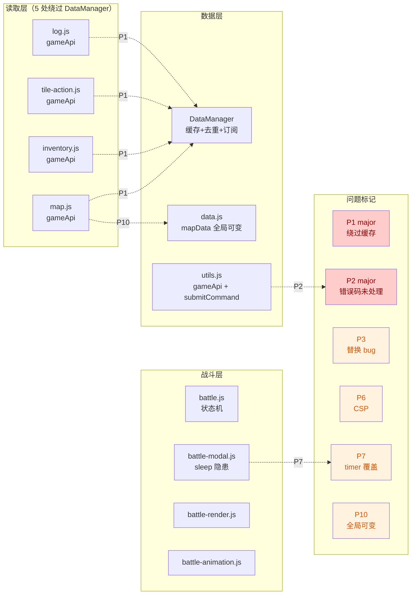

# Vex 前端项目代码审阅报告

> 审阅范围：`vex/` 全部前端代码（15 个 JS 模块 + 4 个 CSS + 1 个 HTML + 1 个 PHP 标记接口）
> 审阅方法：全量代码阅读 + 双子代理交叉验证
> 审阅日期：2026-06-22

---

## 一、整体评价

Vex 是一个无框架依赖的 ES Modules 单页应用，架构清晰、模块分层合理、注释详尽。**整体代码质量高于业界平均水平**，特别是：

- 模块职责划分基本清晰，依赖图无环
- DataManager 的"缓存+去重+订阅"三层设计成熟
- 战斗演出系统的"三阶段播放 + 三层锁"设计严谨
- 结构化日志系统前后端解耦彻底

但存在 **2 个 major 级问题** 和若干 minor 级技术债务，需在迭代中逐步清理。

---

## 二、问题汇总表

| 编号 | 问题 | 类别 | 严重程度 | 优先级 |
|------|------|------|---------|--------|
| P1 | 多模块绕过 DataManager 直接调用 gameApi | 架构/性能 | major | 高 |
| P2 | submitCommand 未处理 COMMAND_IN_PROGRESS 错误码 | 后端交互/正确性 | major | 高 |
| P3 | renderLogEntry highlight 逻辑 `$` 字符替换 bug | 安全/正确性 | minor | 中 |
| P4 | map.js 过长（775 行）混合多职责 | 代码结构 | minor | 中 |
| P5 | Toast 通用组件错位放在 tile-action.js | 代码结构 | minor | 中 |
| P6 | player.js 内联 onerror 事件违反 CSP | 安全 | minor | 中 |
| P7 | battle-modal.js sleep 的 currentTimer 并发覆盖隐患 | 正确性 | minor | 中 |
| P8 | tile-action.js refreshOpenModal 同名 POI 误匹配 | 正确性 | minor | 中 |
| P9 | tile-action.js handlePickupAll 串行无错误处理 | 错误处理 | minor | 中 |
| P10 | mapData 全局可变状态被多模块直接修改 | 状态管理 | minor | 中 |
| P11 | CODEBASE.md 文档与代码不同步（currentBid） | 文档 | minor | 低 |
| P12 | empty() 函数命名误导 | 命名规范 | minor | 低 |
| P13 | clickMove 等错误文案中英混杂 | 命名规范 | minor | 低 |
| P14 | renderMapGrid 全量重绘无 diff | 性能 | minor | 低 |
| P15 | loadMap 串行加载 enemies 阻塞渲染 | 性能 | minor | 低 |
| P16 | findPath 在 mouseenter 时无缓存 | 性能 | minor | 低 |
| P17 | npcTurnRefreshTimer 无退避/上限 | 健壮性 | minor | 低 |
| P18 | mark_battle_log_played.php 无认证 | 安全 | minor | 低 |
| P19 | 移动端断点单一，状态栏固定 80px | 响应式 | minor | 低 |
| P20 | 函数对象挂载状态（_zoomInitialized 等） | 代码风格 | minor | 低 |
| P21 | debug.js 非 ES Module 风格不一致 | 技术债 | minor | 低 |
| P22 | 注释语言中英混杂 | 代码风格 | minor | 低 |

---

## 三、Major 问题详解

### P1. 多模块绕过 DataManager 直接调用 gameApi

**位置**：

- `map.js:640` `gameApi('game_map')`
- `map.js:670` `gameApi('enemies')`
- `inventory.js:46` `gameApi('player_inventory')`
- `tile-action.js:92` `gameApi('tile_actions')`
- `log.js:137` `gameApi('obl_log')`

**问题**：DataManager 提供了 `_pending` 去重和 `_ttl` 缓存能力，但 5 个读取模块全部绕过它直接调用底层 `gameApi`。当 `map:loaded` 和 `game:action-completed` 事件几乎同时触发时（如 `clickMove` 成功后先 `broadcast('map:loaded')` 再 `broadcast('game:action-completed')`），会发出重复请求，失去去重价值。

**改进方案**：统一改为 `dataManager.fetch(action, forceRefresh)`：

```javascript
// 修改前
const result = await gameApi('obl_log');
// 修改后
const result = await dataManager.fetch('obl_log', true); // 写操作后强制刷新
```

**实施路径**：分 5 个 PR 逐模块替换，每个 PR 验证一次刷新流程无回归。

---

### P2. submitCommand 未处理 COMMAND_IN_PROGRESS 错误码

**位置**：`utils.js:64-98`

**问题**：`CODEBASE.md:240` 明确后端并发冲突时返回 `{ "error": "COMMAND_IN_PROGRESS" }`，但 `submitCommand` 在 HTTP 200 + JSON 响应时无条件返回 `success: true`，仅把 `gamedata.error` 透传到 `error` 字段。调用方（如 `clickMove`）检查 `result.success` 时会误判为成功并触发 `loadMap` 刷新。

CODEBASE.md 第 242 行声称"前端 commandQueue.execute() 会将此视为失败"与实际代码不符。

**改进方案**：

```javascript
// utils.js submitCommand 内
if (contentType.includes('application/json')) {
    const gamedata = await resp.json();
    const hasError = !!gamedata.error;
    return {
        success: !hasError,  // 有 error 字段时 success 为 false
        gamedata: gamedata,
        redirect: gamedata.redirect || null,
        timer: gamedata.timer || null,
        error: gamedata.error || null,
        message: hasError ? '命令执行中，请稍候' : null
    };
}
```

**实施路径**：单 PR 修复 + 补充测试用例（模拟后端返回 COMMAND_IN_PROGRESS）。

---

## 四、Minor 问题详解（按优先级排序）

### P3. renderLogEntry highlight 逻辑 `$` 字符替换 bug

**位置**：`log-templates.js:285`

**问题**：`text.replace(escaped, wrapped)` 中，若 `escaped` 包含 `$` 字符（如道具名 `"$1金币"`），`replace` 会把 `$&`、`$1` 等当作特殊匹配模式，导致替换结果异常。

**改进方案**：使用函数形式的 replace 避免特殊字符解释：

```javascript
text = text.replace(escaped, () => wrapped);
```

---

### P4. map.js 过长（775 行）混合多职责

**位置**：`map.js`

**问题**：单文件包含缩放状态、可达性 BFS、路径查找、坐标索引、地图渲染、键盘交互、拖拽/触摸、加载、居中等 10+ 职责。

**改进方案**：拆分为：

- `map-render.js` — renderMapGrid + buildCoordIndex
- `map-reachability.js` — computeReachableMap + isReachable + findPath
- `map-interaction.js` — 缩放/平移/键盘/触摸
- `map.js` — loadMap + clickMove + 模块导出

---

### P5. Toast 通用组件错位放在 tile-action.js

**位置**：`tile-action.js:19-75`

**问题**：`showToast` 是通用 UI 组件，被 `log.js` 跨模块导入，放在 tile-action 模块属于职责错位。

**改进方案**：抽取到独立的 `toast.js`，`tile-action.js` 和 `log.js` 都从 `toast.js` 导入。

---

### P6. player.js 内联 onerror 事件违反 CSP

**位置**：`player.js:33`

**问题**：`` 是内联事件处理器，违反 CSP `script-src` 指令。

**改进方案**：

```javascript
const img = document.createElement('img');
img.src = imgSrc;
img.alt = 'avatar';
img.addEventListener('error', function() {
    avatarEl.innerHTML = '<span class="status-avatar-fallback">???</span>';
});
avatarEl.innerHTML = '';
avatarEl.appendChild(img);
```

---

### P7. battle-modal.js sleep 的 currentTimer 并发覆盖隐患

**位置**：`battle-modal.js:288-294`

**问题**：`sleep` 函数将 `setTimeout` 返回值赋给模块级 `currentTimer`。`closeBattleModalInternal` 第 150 行 `clearTimeout(currentTimer)` 会清除最近的 timer，导致正在 await 的 sleep Promise 永远不 resolve。

**改进方案**：使用 AbortController 或返回 `{ promise, cancel }` 对象，避免共享单一 timer 变量。

---

### P8. tile-action.js refreshOpenModal 同名 POI 误匹配

**位置**：`tile-action.js:382-398`

**问题**：通过 `titleEl.textContent.trim()` 匹配 `pois[i].name`，若同一格有两个同名 POI 会始终匹配到第一个。

**改进方案**：在 `openModal` 时将来源标识缓存到 `modalOverlay.dataset.source` / `dataset.iaid`，`refreshOpenModal` 直接读取。

---

### P9. tile-action.js handlePickupAll 串行无错误处理

**位置**：`tile-action.js:404-411`

**问题**：`for` 循环 `await commandQueue.execute(...)` 不检查 `result.success`，中间失败不停止，最后统一 `broadcast('game:action-completed')` 会让用户误以为全部成功。

**改进方案**：检查每次结果，失败时 `showToast` 提示并 break；或改为 `Promise.allSettled` 并行（但需后端支持）。

---

### P10. mapData 全局可变状态被多模块直接修改

**位置**：`data.js:84` 导出，`map.js:655-657` 直接修改

**问题**：`mapData` 是 `const` 对象（仅保护引用），属性被 map.js 直接修改，无订阅机制。状态变更依赖 `dataManager.broadcast('map:loaded')` 显式通知。

**改进方案**：将 `mapData` 改为 DataManager 管理的缓存项，或封装为 `getMapData()` / `setMapData()` 并自动广播。

---

## 五、低优先级问题（P11-P22）

| 编号 | 简述 | 实施建议 |
|------|------|---------|
| P11 | CODEBASE.md 写 `currentBid`，代码是 `currentEnemyPid` | 同步文档 |
| P12 | `empty(v)` 实为 `isFalsy`，命名误导 | 重命名为 `isFalsy` 或 `shouldBlock` |
| P13 | `clickMove` 错误文案 'move failed' 与中文文案混杂 | 统一为中文 |
| P14 | `renderMapGrid` 全量 `innerHTML=''` 重建 | 10x10=100 格影响可控，暂不优化 |
| P15 | `loadMap` 中 `await gameApi('enemies')` 串行阻塞 | 可 `Promise.all` 并行 |
| P16 | `findPath` 在 `mouseenter` 时无缓存 | 地图小，BFS 开销低，可选优化 |
| P17 | `npcTurnRefreshTimer` 无退避/上限 | 增加最大重试次数或指数退避 |
| P18 | `mark_battle_log_played.php` 无认证 | 文档已说明设计决策，低风险 |
| P19 | 移动端仅 900px 断点，状态栏固定 80px | 增加 600px / 400px 断点 |
| P20 | `renderMapGrid._zoomInitialized` 函数挂载状态 | 改为模块级 `let` 变量 |
| P21 | `debug.js` 非 ES Module | 文档已说明是"唯一例外" |
| P22 | 注释中英混杂 | 统一为中文（项目主语言） |

---

## 六、实施路径

### 第一阶段（高优先级，建议立即修复）

1. **P2** 修复 submitCommand 错误码处理 — 单 PR，影响面广但改动小
2. **P1** 统一使用 DataManager.fetch — 分 5 个 PR 逐模块迁移
3. **P3** 修复 renderLogEntry `$` 字符 bug — 单 PR，1 行改动

### 第二阶段（中优先级，建议下个迭代）

4. **P5** 抽取 toast.js 独立模块 — 重构 PR
5. **P6** 移除内联 onerror 事件 — 单 PR
6. **P7** 重构 battle-modal sleep 机制 — 单 PR
7. **P8** 修复 refreshOpenModal 同名 POI 问题 — 单 PR
8. **P9** 改进 handlePickupAll 错误处理 — 单 PR

### 第三阶段（低优先级，技术债清理）

9. **P4** 拆分 map.js — 大重构，需充分测试
10. **P10** 重构 mapData 状态管理 — 大重构
11. **P11-P22** 文档同步、命名规范、响应式适配等 — 持续迭代

---

## 七、架构与问题分布图



---

## 八、结论

Vex 前端项目整体架构健康，文档详尽，设计决策有据可查。**2 个 major 问题（P1/P2）需优先修复**，主要影响并发场景下的正确性和缓存效率。其余 minor 问题多为代码风格、健壮性改进和文档同步，可在后续迭代中逐步清理。

项目最大的技术债是 **map.js 的体量（775 行）** 和 **mapData 的全局可变状态**，建议在中期重构中重点处理。
